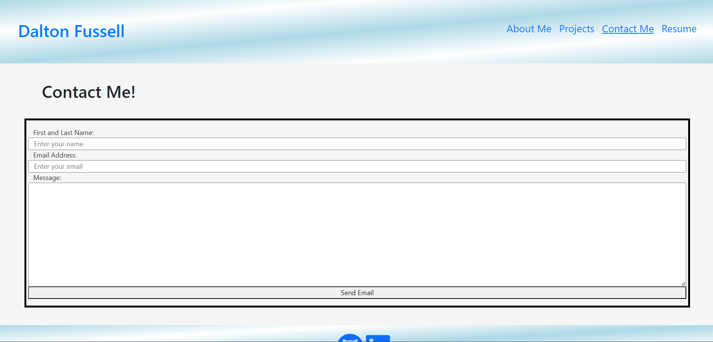

  # Dalton's REACT Portfolio 

  ## Description
  This repository contains code that builds my professional REACT Portfolio! When users land on the app for the first time, they are greeted with my About Me page, where they can see info about me, a Nav Bar at the top that goes to different parts of the app, and a footer with a link to my GitHub and my LinkedIn, for now, another platform will be added soon. When they navigate to the Projects section, they can see six of some of my best projects that I have created thus far, some with some awesome collaborators! If they click on the image of the project, they will be taken to the deployed application, where they can explore each project themselves. A link to the repository will be added to each project soon, so each user can see the code that generated each app. Users can navigate to the Contact Me section, where they can fill out a form to email me, once that form has been modified to be sent to the correct location. That is also something that will be added here soon as well. They can also navigate to my Resume section, where they will be able to download a PDF file of my Resume, once I update it and add it in, and they can see a list of my proficiencies too. My portfolio is not exactly how I want it to look and function just yet, but this will be updated daily to fix some of the things that I think are necessary! I hope you enjoy getting to know me just a bit better and seeing some of my work! 

  ## Table of Contents

  - [Installation](#installation)
  - [Usage](#usage)
  - [Contributing](#contributing)
  - [Tests](#tests)
  - [License](#license)
  - [Questions](#questions)
  - [Screenshots](#screenshots)
  - [Deployed App](#deployed-app)

  ## Installation 
  To install any necessary dependencies, run "npm i"

  To build the application using Vite, run "npm run build"
  
  To start the application, run "npm run start"

  ## Usage 
  Showcasing my professional REACT Portfolio

  ## Contributing 
  There are no contribution guidelines. 

  ## Tests 
  There are no tests. 

  ## License
  
  This repository has no license.

  ## Questions

  My GitHub: https://github.com/dfussell1

  For any questions or concerns regarding this repository or my work, please reach out to me at daltonfussell1@gmail.com

  ## Screenshots

  
  
  
  

  ## Deployed App
  https://65d584a68875064e0ad4257c--radiant-pudding-d94d24.netlify.app/

  For some reason, the deployed app does not render the projects page nor the nav bar items correctly. This will be researched and fixed. 